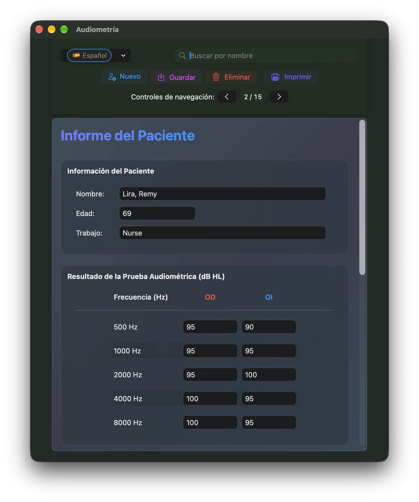
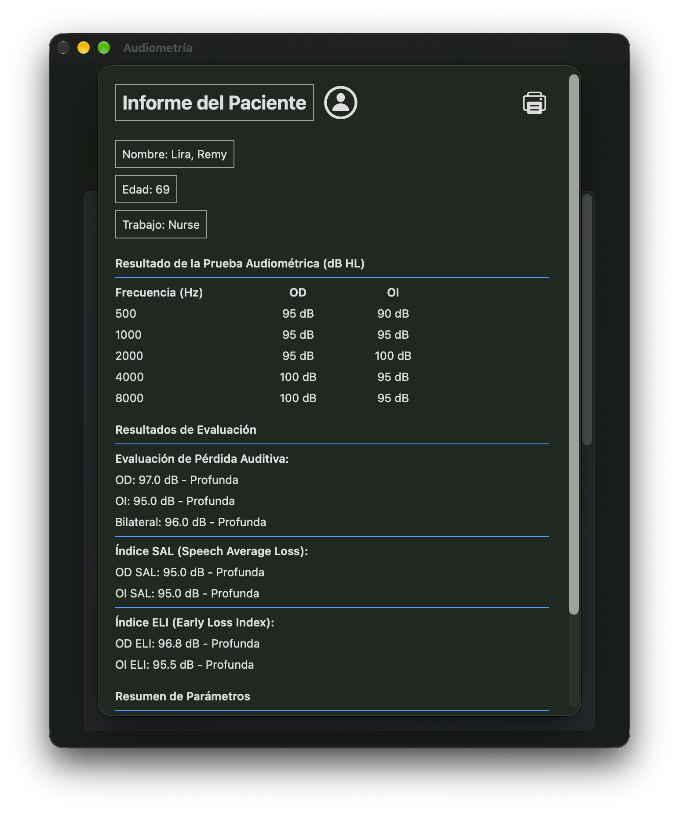

# Audiometría


## Aplicación de audiometría en SwiftUI para macOS

| Ventana principal |
|:----|
|  |

| Informe para imprimir |
|:----|
|  |

Audiometría es una aplicación macOS desarrollada con SwiftUI para registrar los datos de pruebas auditivas de pacientes, calcular los resultados de pérdida auditiva e imprimir informes de pacientes. El estado actual del proyecto se centra en un único flujo de persistencia basado en SwiftUI, respaldado por un almacén JSON en Application Support.

## Estado actual del proyecto

- Proyecto en Swift 6
- Objetivo mínimo de despliegue: macOS 14.6
- Ciclo de vida de la aplicación con SwiftUI
- Una única ruta de persistencia mediante `PatientDataStore`
- Registros de pacientes almacenados como JSON
- Datos de pacientes de ejemplo copiados en el primer inicio
- Cambio de idioma en tiempo de ejecución
- Flujo nativo de vista previa de impresión e informe de macOS

## Funcionalidades

- Introducción de datos del paciente: nombre, edad y ocupación
- Entrada audiométrica para ambos oídos a 500, 1000, 2000, 4000 y 8000 Hz
- Cálculos de evaluación de la pérdida auditiva
- Cálculos de los índices SAL y ELI con resultados categorizados
- Guardado, actualización, eliminación y búsqueda de pacientes, además de navegación anterior/siguiente
- Informe imprimible de paciente
- Interfaz localizada en inglés, español, francés e italiano

## Almacenamiento de datos

La aplicación utiliza una única implementación de almacenamiento: el estado de la aplicación gestionado por SwiftUI se conserva mediante `PatientDataStore`.

- Archivo de datos: `/Users/<user_name>/Library/Containers/perez987.Audiometry/Data/Library/Application Support/Audiometry/patients.json`
- Fuente de datos de ejemplo incluida en la aplicación: `Sample-data/patients.json`
- En el primer inicio, el archivo de ejemplo incluido se copia en Application Support si todavía no existe una base de datos de pacientes

Para migrar los datos a otro equipo, copie `patients.json` en la misma ubicación de Application Support antes de iniciar la aplicación.

## Estructura del proyecto

- `/Audiometry/AudiometryApp.swift` — punto de entrada de la aplicación
- `/Audiometry/Views/ContentView.swift` — interfaz principal para editar pacientes y mostrar resultados
- `/Audiometry/Model/PatientDataStore.swift` — persistencia respaldada por JSON
- `/Audiometry/Model/PatientNavigationView.swift` — vista de navegación de SwiftUI para las acciones de la barra superior, búsqueda, navegación y menú de idioma
- `/Audiometry/Model/AudiometryCalculations.swift` — cálculos de pérdida auditiva, SAL y ELI
- `/Audiometry/<language>.lproj/Localizable.strings` — cadenas localizadas

## Compilación

Abre `Audiometry.xcodeproj` en Xcode y ejecute el esquema `Audiometry` en macOS.

Compilación desde la línea de comandos:

```bash
xcodebuild -project Audiometry.xcodeproj -scheme Audiometry -destination 'platform=macOS' build
```
