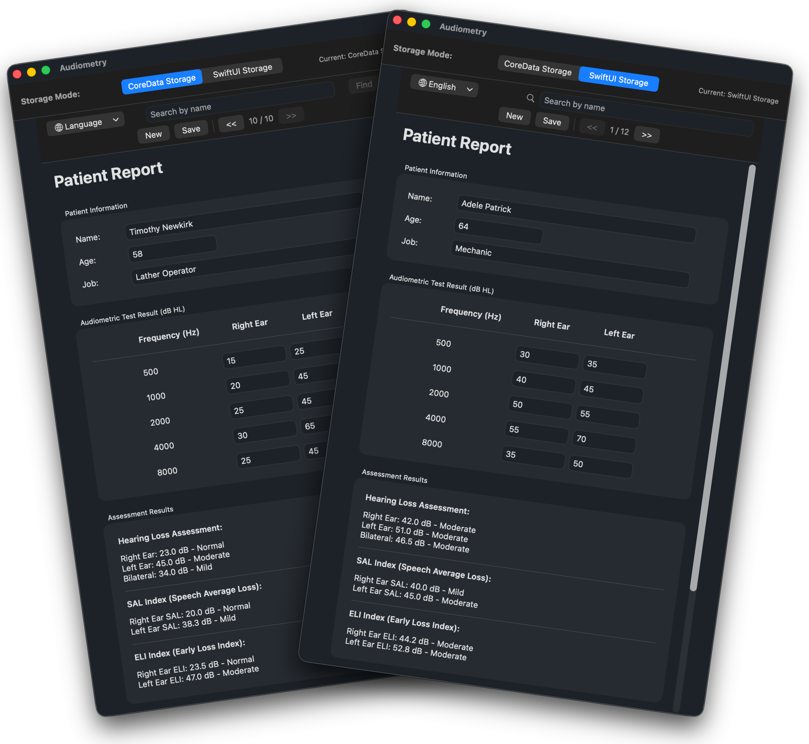

# Audiometry

<!--  -->

## App for macOS 13+

While this is a valid app for everyday use, it's more of an exercise in learning SwiftUI and persistent data storage. Think of it as a way to practice SwiftUI with a functional app that you can modify to your liking.

## Summary

- Xcode 15.2 project
- App runs on macOS13+
- Features:
  - patient data entry
  - audiometric test input
  - hearing loss assessment calculations
  - including SAL and ELI indices with results display
  - dual storage system: CoreData and SwiftUI storage (toggle between them)
  - save patients data in core data or JSON file
  - language system with English and Spanish
  - buttons to move back and forth between saved patients
  - search button
  - print report of current patient. 

## Dual Storage Implementation

The application now supports two different storage mechanisms that you can switch between:

1. CoreData Storage - Traditional Apple framework using SQLite database
2. SwiftUI Storage - Native SwiftUI approach using JSON files

A segmented control at the top of the window allows you to switch between storage modes. Each storage system maintains its own separate data.

The implementation of SwiftUI Storage alongside CoreData Storage allows users to compare the two approaches side-by-side. Users can now toggle between both storage methods to learn about them and evaluate which best suits their needs. Each storage system maintains its own separate data.

## Patient data saved
  
Patient data are saved in different files depending on the storage mode:

**CoreData Storage**

`/Users/<user_name>/Library/Containers/perez987.Audiometry/Data/Library/Application Support/Audiometry/DataModel.sqlite`

**SwiftUI Storage**

`/Users/<user_name>/Library/Containers/perez987.Audiometry/Data/Library/Application Support/Audiometry/patients.json`

You can bring your saved data back by copying those files (SQLite database and JSON file) to a different machine and running the Audiometry app on it.

## Extended information on features
  
### 🌐 Language Support

- **Bilingual Interface**: Switch between English and Spanish
- **Localized Classifications**: Hearing loss classifications in both languages
- **Complete UI Translation**: All interface elements support both languages.

### 💾 Patient Data Management

- **Core Data Integration**: Persistent storage of patient records
- **Save button**: Patient data saved. When saving data, patients are sorted by name
- **Patient Navigation**: Browse through saved patients with Previous/Next buttons
- **New Patient Creation**: Easy creation of new patient records.

### 🔍 Search & Navigation

- **Patient Search**: Search patients by name with dedicated search interface
- **Patient Counter**: Shows current position in patient list (e.g., "1 / 3")
- **Quick Access**: Navigation bar with all essential functions.

### 🏥 User Experience

- **Streamlined Workflow**: All patient management functions in top navigation bar
- **Preserved Functionality**: All original audiometry calculations maintained
- **macOS Design**: Native macOS interface following Apple's design guidelines.

