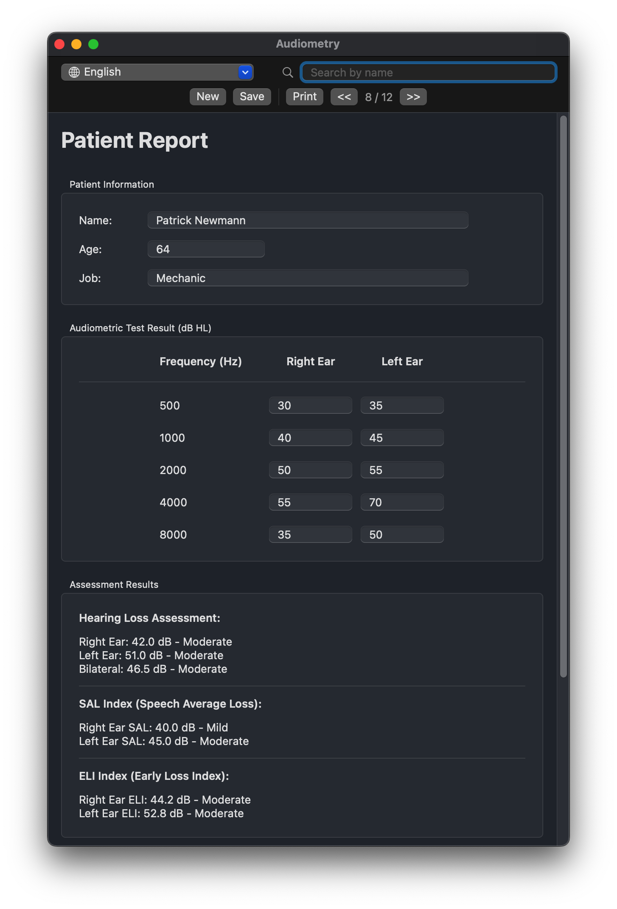

# Audiometry

## App for macOS 13+

While this is a valid app for everyday use, it's more of an exercise in learning SwiftUI and persistent data storage. Think of it as a way to practice SwiftUI with a functional app that you can modify to your liking.

## Summary

- Xcode 15.2 project
- App runs on macOS13+
- Features:
  - patient data entry
  - audiometric test input
  - hearing loss assessment calculations
  - including SAL and ELI indices with results display
  - SwiftUI storage system using JSON files
  - save patients data in JSON file
  - language system with English and Spanish
  - buttons to move back and forth between saved patients
  - search button.

## SwiftUI Storage Implementation

This branch uses SwiftUI native storage with JSON files for patient data persistence. Data is stored in:

`/Users/<user_name>/Library/Containers/perez987.Audiometry/Data/Library/Application Support/Audiometry/patients.json`

You can bring your saved data back by copying the JSON file to a different machine and running the Audiometry app on it.

> **Note:** For a version with dual storage (CoreData and SwiftUI) that allows switching between both, see the `main` branch. For a CoreData-only version, see the `coredata` branch.

## Extended information on features
  
### 🌐 Language Support

- **Bilingual Interface**: Switch between English and Spanish
- **Localized Classifications**: Hearing loss classifications in both languages
- **Complete UI Translation**: All interface elements support both languages.

### 💾 Patient Data Management

- **SwiftUI Storage**: Persistent storage of patient records using JSON files
- **Save button**: Patient data saved. When saving data, patients are sorted by name
- **Patient Navigation**: Browse through saved patients with Previous/Next buttons
- **New Patient Creation**: Easy creation of new patient records.

### 🔍 Search & Navigation

- **Patient Search**: Search patients by name with dedicated search interface
- **Patient Counter**: Shows current position in patient list (e.g., `1/3`)
- **Quick Access**: Navigation bar with all essential functions.

### 🏥 User Experience

- **Streamlined Workflow**: All patient management functions in top navigation bar
- **Preserved Functionality**: All original audiometry calculations maintained
- **macOS Design**: Native macOS interface following Apple's design guidelines.

