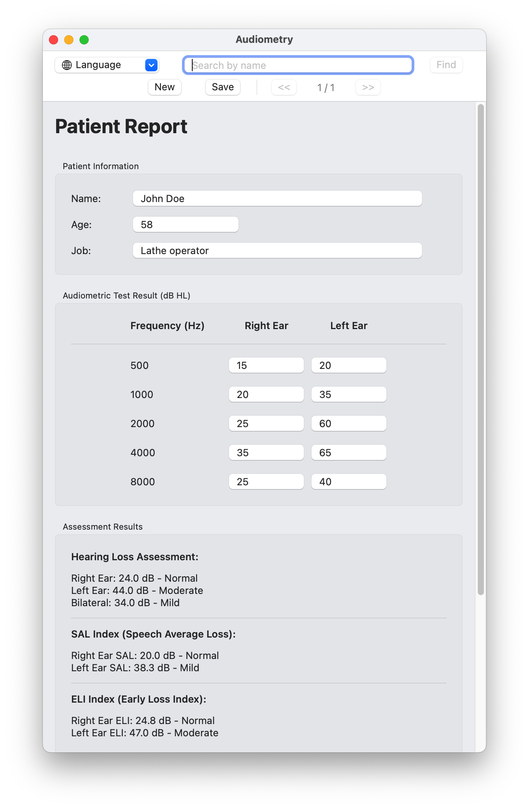

# Audiometry

## App for macOS 13+

- Xcode 15.2 project

- Implements:
  - patient data entry
  - audiometric test input
  - hearing loss assessment calculations
  - including SAL and ELI indices with results display
  - save patients data in core data
  - language system with English and Spanish
  - buttons to move back and forth between saved patients
  - search button.
