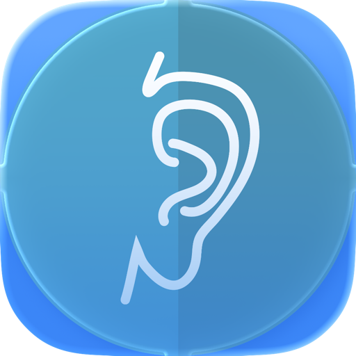

# Audiometry

## App for macOS 13+

- Xcode 15.2 project
- Implements:
  - patient data entry
  - audiometric test input
  - hearing loss assessment calculations
  - including SAL and ELI indices with results display.

## New Features (Enhanced Version)

### 🌐 Language Support
- **Bilingual Interface**: Switch between English and Spanish
- **Localized Classifications**: Hearing loss classifications in both languages
- **Complete UI Translation**: All interface elements support both languages

### 💾 Patient Data Management
- **Core Data Integration**: Persistent storage of patient records
- **Auto-Save**: Patient data automatically saved when modified
- **Patient Navigation**: Browse through saved patients with Previous/Next buttons
- **New Patient Creation**: Easy creation of new patient records

### 🔍 Search & Navigation
- **Patient Search**: Search patients by name with dedicated search interface
- **Patient Counter**: Shows current position in patient list (e.g., "1 / 3")
- **Quick Access**: Navigation bar with all essential functions

### 🏥 Enhanced User Experience
- **Streamlined Workflow**: All patient management functions in top navigation bar
- **Preserved Functionality**: All original audiometry calculations maintained
- **macOS Design**: Native macOS interface following Apple's design guidelines

## Technical Implementation

### New Files Added:
- `LanguageManager.swift` - Language switching and localization management
- `Patient.swift` - Core Data entity for patient records
- `PersistenceController.swift` - Core Data stack management
- `PatientNavigationView.swift` - Navigation and search UI components
- `en.lproj/Localizable.strings` - English translations
- `es.lproj/Localizable.strings` - Spanish translations
- `DataModel.xcdatamodeld/` - Core Data model definition

### Key Features:
- **Minimal Code Changes**: Enhanced existing code without breaking functionality
- **Modular Design**: New features as separate components
- **Core Data Integration**: Full patient data persistence
- **Reactive UI**: SwiftUI with @State and @ObservedObject for real-time updates
