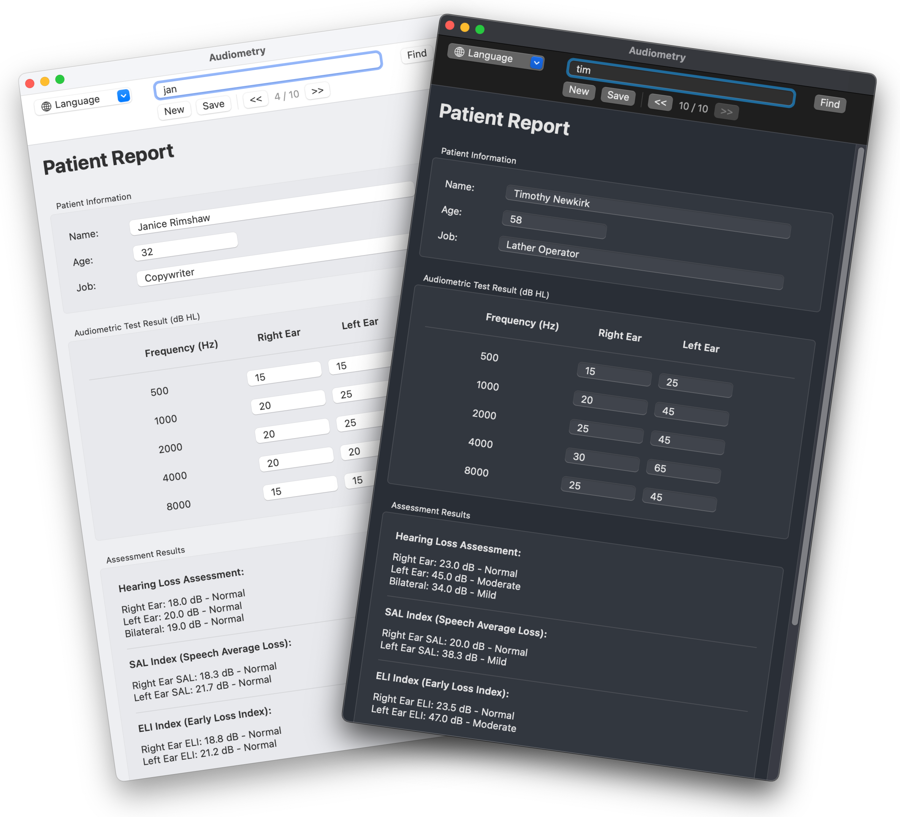

# Audiometry

## App for macOS 13+

- Xcode 15.2 project

- Implements:
  - patient data entry
  - audiometric test input
  - hearing loss assessment calculations
  - including SAL and ELI indices with results display.

- To do:
  - patient data entry
 	- audiometric test input
 	- hearing loss assessment calculations
 	- including SAL and ELI indices with results display.
