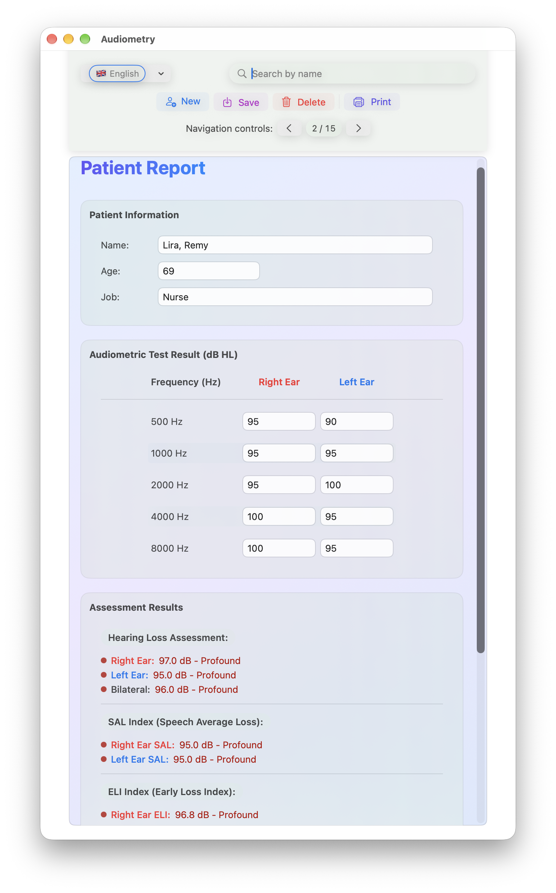
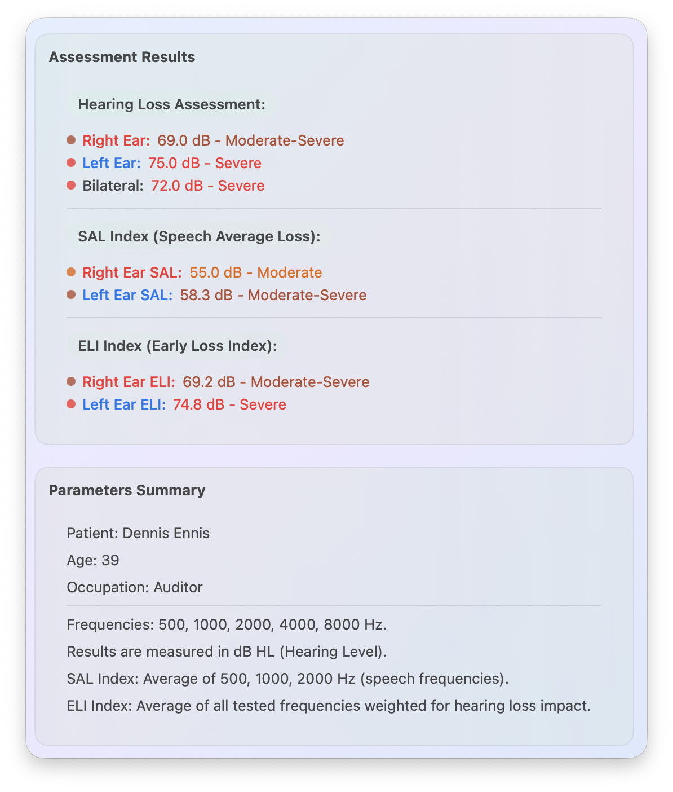
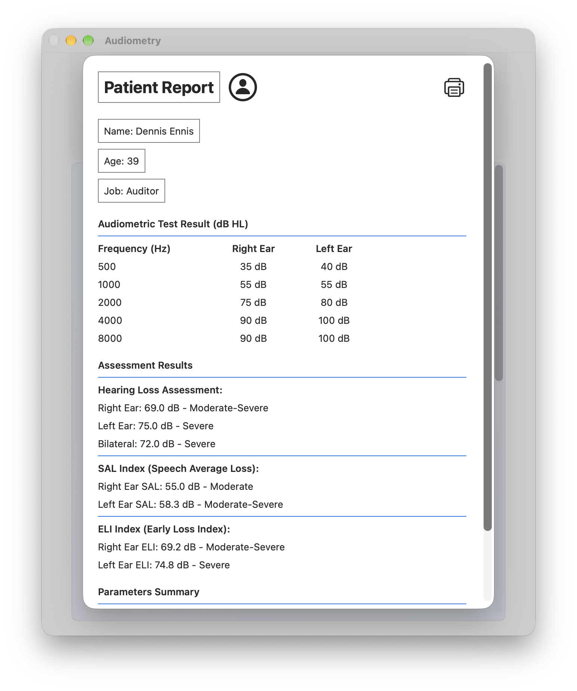

# Audiometry


## SwiftUI audiometry app for macOS







Audiometry is a macOS SwiftUI application for capturing patient hearing test data, calculating hearing-loss results, and printing patient reports. The current project state is focused on a single SwiftUI-based persistence flow backed by a JSON store in Application Support.

## Current project state

- Swift 6 project
- Minimum deployment target: macOS 14.6
- SwiftUI app lifecycle
- Single persistence path through `PatientDataStore`
- Patient records stored as JSON
- Sample patient data copied on first launch
- Runtime language switching
- Native macOS print preview/report flow

## Features

- Patient data entry for name, age, and occupation
- Audiometric input for both ears at 500, 1000, 2000, 4000, and 8000 Hz
- Hearing loss assessment calculations
- SAL and ELI index calculations with categorized results
- Patient save, update, delete, search, and previous/next navigation
- Printable patient report
- Localized UI in English, Spanish, French, and Italian

## Data storage

The app uses one storage implementation: SwiftUI-managed app state persisted through `PatientDataStore`.

- Data file: `/Users/<user_name>/Library/Containers/perez987.Audiometry/Data/Library/Application Support/Audiometry/patients.json`
- Sample data source bundled with the app: `Sample-data/patients.json`
- On first launch, the bundled sample file is copied into Application Support if no patient database exists yet

To migrate data to another machine, copy `patients.json` to the same Application Support location before launching the app.

## Project structure

- `/Audiometry/AudiometryApp.swift` — app entry point
- `/Audiometry/Views/ContentView.swift` — main patient editing and results UI
- `/Audiometry/Model/PatientDataStore.swift` — JSON-backed persistence
- `/Audiometry/Model/PatientNavigationView.swift` — SwiftUI navigation view for top-bar actions, search, navigation, and language menu
- `/Audiometry/Model/AudiometryCalculations.swift` — hearing-loss, SAL, and ELI calculations
- `/Audiometry/<language>.lproj/Localizable.strings` — localized strings

## Build

Open `Audiometry.xcodeproj` in Xcode and run the `Audiometry` scheme on macOS.

Command-line build:

```bash
xcodebuild -project Audiometry.xcodeproj -scheme Audiometry -destination 'platform=macOS' build
```
